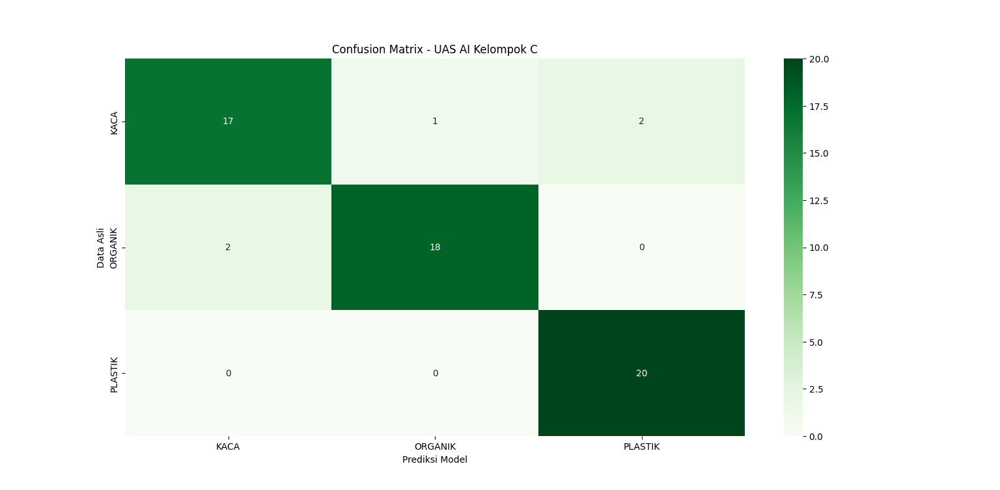

# Proyek UAS Kecerdasan Buatan (Kelas C)
**Dosen Pengampu:** Dr. Raden Arief Setyawan, ST., MT.  
**Nama Mahasiswa / Nim:** PRADITA MAHAR AYU / 245060301111019

---

## 1. Penjelasan Proyek
Proyek ini mengimplementasikan algoritma **Convolutional Neural Network (CNN)** untuk mengklasifikasikan 3 jenis sampah secara otomatis: **Organik**, **Kaca**, dan **Plastik**. Tujuan sistem ini adalah membantu pemilahan sampah cerdas berbasis vision komputer.

## 2. Dataset atau Link Dataset
* **Total Data:** 300 Gambar.
* **Distribusi:** 3 Kelas (Organik: 100 gambar, Kaca: 100 gambar, Plastik: 100 gambar).
* **Pembagian Data:** 80% Data Training (240 gambar) dan 20% Data Testing (60 gambar).

## 3. Hasil Evaluasi Model
Model dilatih menggunakan arsitektur CNN dengan teknik *Data Augmentation* untuk mencegah overfitting. Evaluasi akhir menggunakan *Confusion Matrix* menunjukkan performa model yang sangat baik (Akurasi ~91.6%). Klasifikasi untuk jenis sampah plastik mencapai presisi sempurna (20/20 gambar tertebak benar).

Berikut adalah visualisasi **Confusion Matrix**:

## 4. Link Video Demo (3-5 Menit)
[KLIK DI SINI UNTUK MENONTON VIDEO DEMO PROYEK](https://drive.google.com/drive/folders/1h8lKMlNFCu7cInWHngrXoa1xnrud4gVS?usp=sharing)
